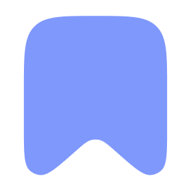
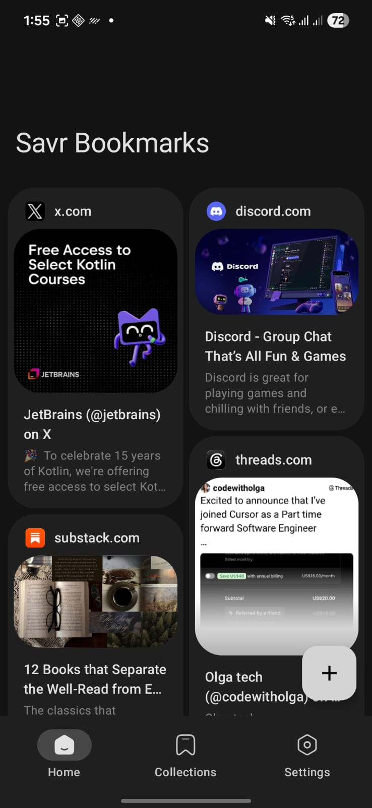
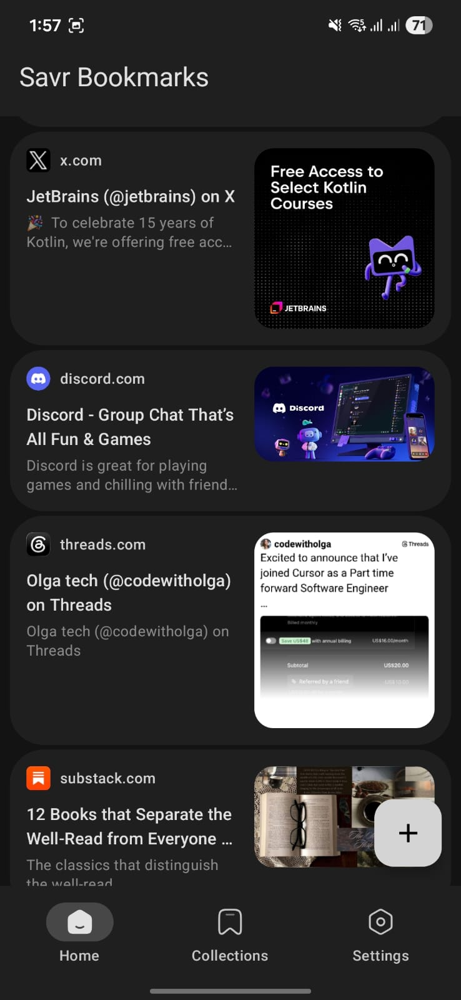
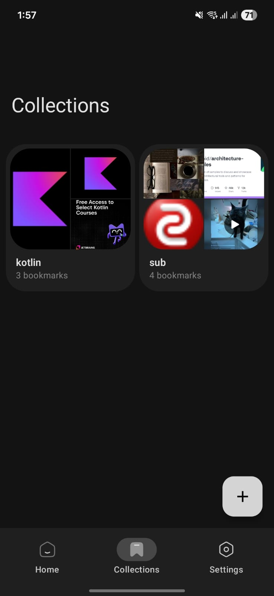
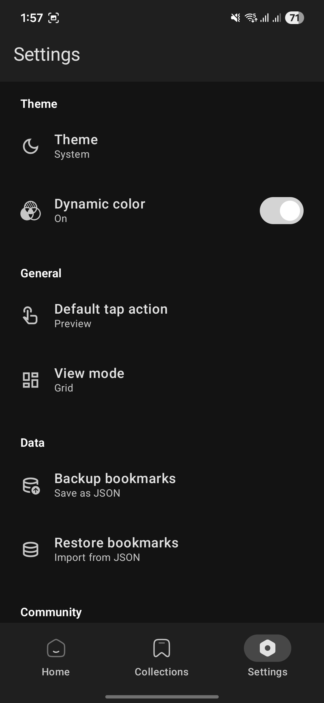
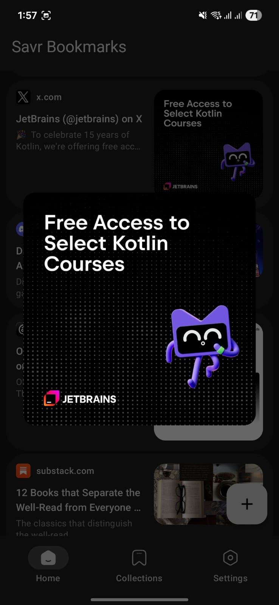
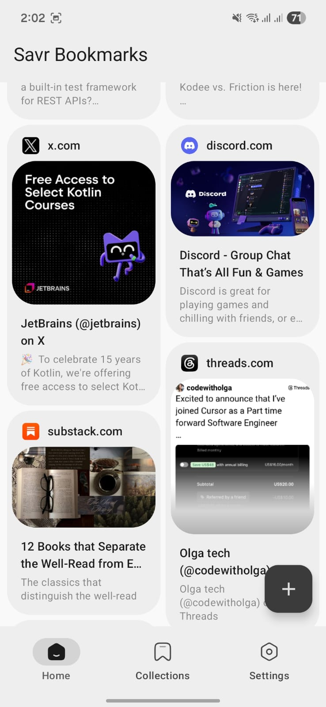
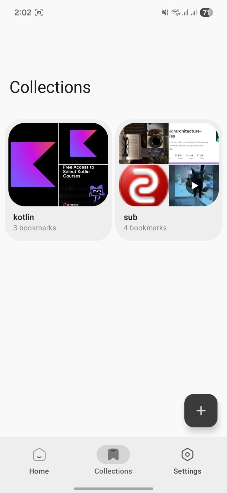
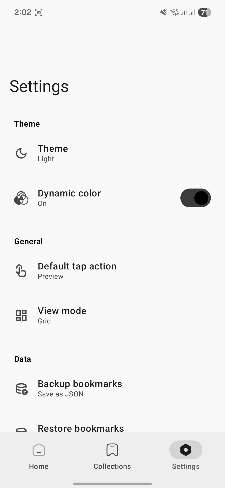

  

<h1 align="center">Savr</h1>

  <i>Paste a link. That's it.</i>

  

  <b>Play Store release is under closed testing — please be patient :)</b>

---

Every bookmark app I tried was either crammed with stuff I'd never use or wanted me to pay monthly just to save a URL. So I built the thing I actually wanted: drop a link, grab the metadata, move on. No signups, no cloud, no tracker pestering you.

## What's in the box

- **Paste any URL.** => Savr grabs the title, description, and preview image. You don't lift a finger.
- **Collections.** => Group bookmarks without dealing with nested folders. Name it, throw links in, move on.
- **Selection mode.** => Long-press a bookmark, then batch delete or move multiple at once.
- **Quick preview.** => Tap any bookmark to see what's inside before opening it in your browser.
- **Material You colors.** => Matches your wallpaper. Light, dark, or system default.
- **Custom tap action.** => Set a single tap to preview, open in browser, or copy the link.
- **Grid or List.** => Cards or a compact list. Flip between them whenever.
- **Backup & restore.** => Export or import everything as JSON. Your data, your call.

## Screenshots

| Home (Grid) | Home (List) |
|:-----------:|:-----------:|
|  |  |

| Collections | Settings |
|:-----------:|:--------:|
|  |  |

| Image Preview | Light Theme |
|:-------------:|:-----------:|
|  |  |

| Light Theme 2 | Light Theme 3 |
|:-------------:|:-------------:|
|  |  |

## Stack

| | |
|---|---|
| **Language** | Kotlin |
| **UI** | Jetpack Compose + Material 3 |
| **Architecture** | MVI + StateFlow |
| **DI** | Koin |
| **Database** | Room |
| **Networking** | OkHttp, Jsoup |
| **Images** | Coil |

## Credits

Metadata parsing powered by [Android-Link-Preview](https://github.com/vishalkumarsinghvi/Android-Link-Preview) by Vishal Kumar Singhvi.

## Found a bug? Got an idea?

[Open an issue](https://github.com/qeiq/Savr/issues). Or just say hi — I don't bite.

If this app saves you even one headache, a star would mean a lot.

