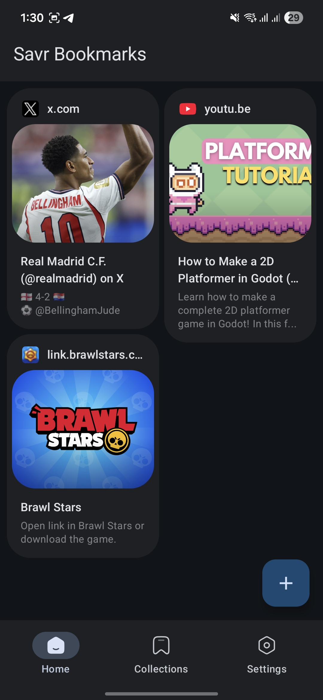
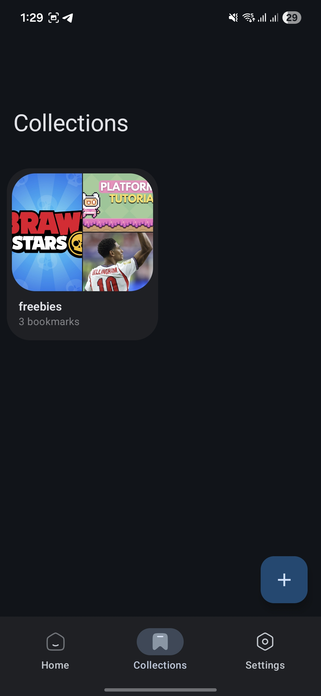
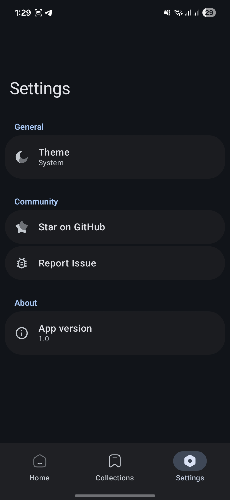
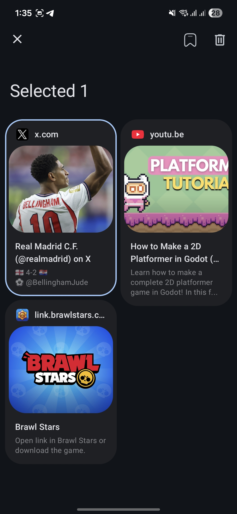

# Savr

## A bookmark manager that actually saves what matters.

Savr is a minimal, no-nonsense bookmark manager born from a personal frustration, most bookmarking apps are try to do too much. I wanted something simple: paste a URL, get the title, description, and image automatically, and move on. No accounts, no sync, no clutter.

It's free, open source forever, and coming soon to the Play Store.

## Features

- **Auto-fetch metadata** — paste any URL and Savr grabs the title, description, and preview image automatically.
- **Collections** — organize your bookmarks into custom collections.
- **Theme options** — Light, Dark, or System default with proper status bar contrast.
- **Selection mode** — long-press to select multiple bookmarks for batch actions.
- **Preview sheet** — tap a bookmark to preview its content and open it in your browser.
- **Minimal & fast** — built with Jetpack Compose, no bloat, no accounts.

## Screenshots

| Home | Collections |
|---|---|
|  |  |

| Setting | Selection |
|---|---|
|  |  |

## Tech Stack

- **Language:** Kotlin
- **UI:** Jetpack Compose + Material 3
- **Architecture:** MVI (Model-View-Intent) with StateFlow
- **DI:** Koin
- **Database:** Room
- **Metadata parsing:** Jsoup + OkHttp
- **Image loading:** Coil

## Acknowledgments

Link metadata parsing is powered by [Android-Link-Preview](https://github.com/vishalkumarsinghvi/Android-Link-Preview) by Vishal Kumar Singhvi.

## Contributing

Found a bug or have an idea? Open an [issue](https://github.com/qeiq/Savr/issues) — all feedback is welcome.

If you find this project useful, consider giving it a ⭐ to help it grow.

